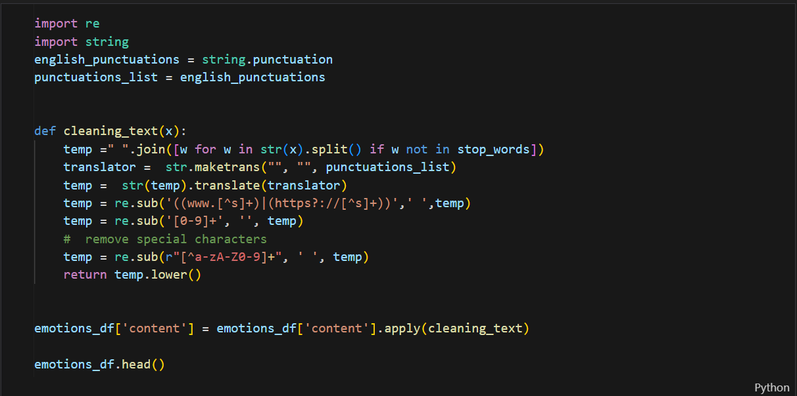
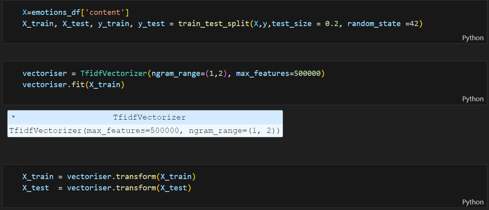
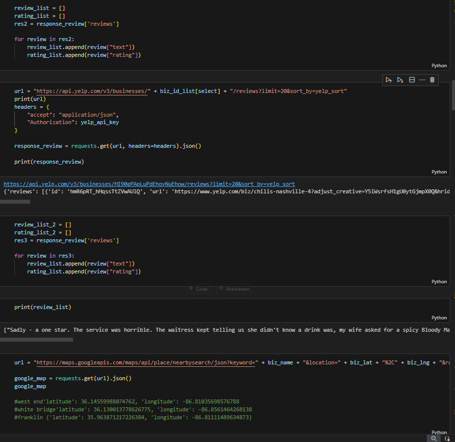
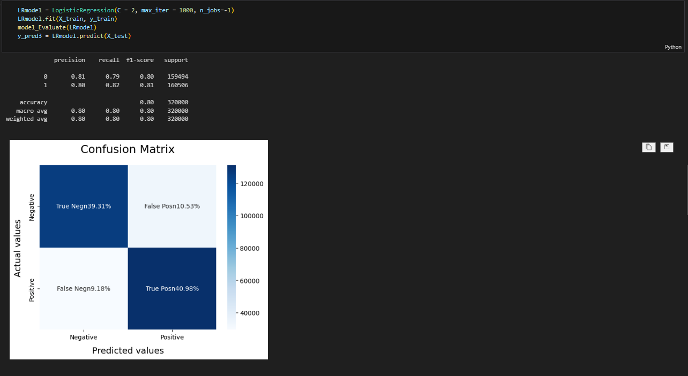
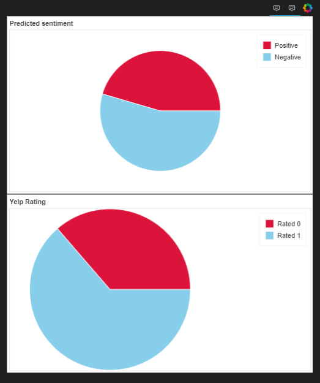
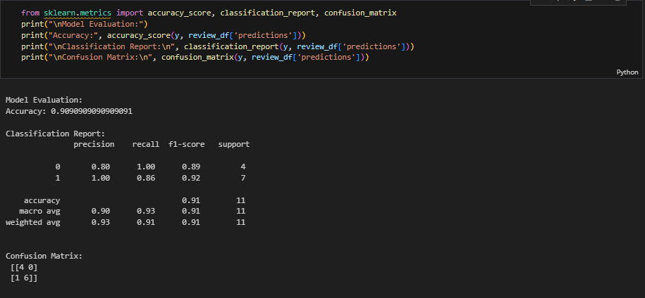

# Project_4: Evaluating reviews of businesses using ML

# Background
The scope of our project is to use a machine learning model to assess the language used by humans when reviewing businesses. These reviews are ran through a trained model and the goal was to see whether or not the model could accurately assess the review as either a positive or negative review, based on the language used by the reviewer.

# Software/Toools:

* Python
* Bokeh
* Pandas
* Excel
* Google/Yelp API
* Numpy
* Nltk
* Pickle
* SKlearn

# Intructions
The assignment is broken down into the following:

1. Obtain Data to train model
    *Initial trail emotion dataset
    * https://www.kaggle.com/datasets/nelgiriyewithana/emotions 
    * Twitter emotion dataset
    * https://www.kaggle.com/code/mayank404/twitter-sentimental-analysis
    * Yelp Review Dataset
    * https://www.kaggle.com/datasets/yacharki/yelp-reviews-for-sa-finegrained-5-classes-csv

2. Initializes, trains and evaluates model
    * Training of MultiModelVector and LRTrained2 model
    * Cleaning of the training Dataset
    * 
    * Setting up vectorizer 
    * 
    * Function used to asses the accuracy of model and show confusion matrix 
    * 

3. Extract Data, Clean and Normalize
    * Using google and yelp API to extract the Data used to evauluate the model
    * 
    * Limitations faced while pulling data from API's

4. Model Accuracy / Optimization
    * Below is the accuracy of the model used on the large Dataset it was trained on
    * 
    * Below is an instance of the model being used to evaluate reviews at the local Chili's here in Nashville on West End
    * 
    * 
    Findings: When using a real life example to evaluate the model, it predicited the correct sentiment of the review (positive or negative) with a 90% accuracy when looking at the Chili's on West End
    * Tailoring what stopwords where included to better increase accuracy of model (n't words)

# Ethics
Within this assignment, the only ethical dilemmas that were faced were pertaing to using the API's from google and yelp to obtain reviews. We were intially hoping for a rather large set of data to evaluate the model all at once, however both yelp and google limit the number of reviews one can access. We thought of trying to obtain more reviews through web scraping, however both websites outlaw against scraping reviews for any use. 

# Models
  

Initial Model  

  

   

  

For our first attempt at model creation used the Kaggle data set Emotions [Data 3], which produced a 94.46% accuracy with the testing portion of the data.   

  

   

  

Preprocessing  

  

   

  

The original data had six categories: joy, sad, fear, love, anger, and Suprise. The bulk of the data was classified as either joy or sadness (262,254 of 416,809 records) so we decided to combine joy and love as one category (positive emotion) and to combine sadness, anger, and fear as one category (negative emotion). The surprise was dropped from the data as that can be either positive or negative, leaving 401,837 records. This resulted in a data set with 226,216 negative and 175,621 positive records.  

  

   

  

Model Creation  

  

   

  

This data was then split into training and testing (20% of the data was used in model testing (321,469 training records, 80,368 testing records). The data wans not case changed. The data was then vectorized with Sklenar's Count Vectorizer (which assigns each word a binary value) with max_ features = 5000 which means that the most common 5000 words are vectorized, and the default English stop words enabled (stop words are not vectorized, and are common parts of grammar that do more to help humans understand than for machines)[1].  

  

The data was fit and transformed for the model and fed into the xg boost classifier, which is an efficient gradient tree boosting algorithm. In this algorithm each tree is trained to predict all the previous trees prediction errors [4]. Trees are created with a subsample for levels within trees, and features are randomly selected from the sub selection. The model creation code is saved in the 'Save_model_trial.ipynb' file.   

  

The model was setup with the objective (which is the 'learning objective' for the type of task [4]) set to 'multi:softmax', the number of classes was set to 2 (in this case the positive and negative sentiment) and a random state of 42.  

  

   

  

Things learned  

  

   

  

When we attempted to put new sentences through the model it was found to produce strange classifications for sentences. It would classify 'I love this' as negative, among other things that looked wrong to a human. In examining the data we found (by random sampling of sentences classified positive or negative) that the original classification of the training data was not what we felt was the best. Our next models were with data that we found after learning this.  

  

   

  

Second Model  

  

For the next series of models, we changed the data set to Kaggle's 'Sentiment140 dataset with 1.6 million tweets' data set [Data 1]. This is a large set, that has a high useability score, and the target column is 0 (negative) and 4 (positive). This model creation code is saved as 'regex_model.ipynb'.  

  

   

  

Preprocessing  

  

   

  

The data has features like the username of the person who sent the tweet that have been dropped as they were not needed.  We replaced the 4s with 1s for positive sentiment, and changed the case of the letters so that the model would not confuse identical words that were in different cases.  

  

A list of stop words was created and applied to the data, and punctuation was removed. Additionally, links, special characters and the @mentions were removed.  

  

   

  

Modeling with XGB Classifier  

  

   

  

The data was split into testing and training and then the model was set up in the same way as the initial model (both for the Count Vectorizer and XGB Classifier). This version of the model evaluated to 72.99% accurate and is saved as 'Trained1.sav' with its associated vectorizer data saved as 'vectorizer.pkl'. The vectorizer data is needed so that if the model is opened in another notebook, the dictionary the model was trained on is there.  

  

The reopening of the model and use of it to make predictions is tested in 'Open_model.ipynb'.  

  

   

  

Things learned  

  

   

  

The model was not as accurate as the initial model.   

  

   

  

   

  

Models 3, 4, and 5  

  

   

  

Our next attempt again used the Kaggle Sentiment140 data and had the same preprocessing of columns and target values. This time we kept all the stop words except 'not' from the English stop words. Next, our data cleaning has us remove the punctuation and replace it with nothing, remove web links, and numbers as well as special characters, and change the case of all letters to lower case. We used the Count Vectorizer with  max_ features reduced to 1200. We created a test train split and took this data and fed it into 3 different models.  

  

   

  

Logistic Regression  

  

Logistic regression is used in cases where there is categorical data that has an output that is either something will or will not happen [6]. The Logistic Regression was set up with the C (inverse of regularization strength, which is a penalty that is used in modeling to prevent overfitting by making additional features more costly. Having more features may make a model more like the training data, but there is always a danger that the feature the model is picking up on is an artifact and will not be true for a larger data set. Penalties for adding features in the model algorithm reduce this danger [5]).  

  

The max iterations were set to 1000, which is how many iterations the solver has to find a minimum for the cost function. The cost function is the method of finding the least error for a model output, which can be a curve that has multiple ups and downs in it on the way to its lowest point (the global minimum), which is where the cost function is very close to the correct value of the target [9].  

  

   

  

BernoulliNB Model 

This is a naive bayes algorithm that is designed for binary classification. Naive Bayes start with the assumptions of feature independence, that any continuous features have a normal distribution [10]. It assumes that categorical data has many categories that fixed probabilities [11] for each class, that all features are of equal importance. It tends to  

The input from the test train split was put into Bernoulli NB with default parameters and found that our accuracy was 0.79. 

  

  

LinearSVC 

  

The linear SVC is a form of the SVM (support vector machine) that uses a linear kernel in the separation of classes [12]. We used the defaults in the model setup. We found that the model had a 0.79 accuracy. 

   

  

Thes models were then saved as LRTrained2.sav, BNBTrained2.sav, and SVCTrained2.sav, with the vectorizer for all of these models saved as MultiModelVectorizer.pkl.  

  

Things learned 

  

The logistic regression seemed to have the best accuracy of any of the models. 

  

# Refrences:
1. https://towardsdatascience.com/basics-of-countvectorizer-e26677900f9c

2. https://www.geeksforgeeks.org/xgboost-for-regression/

3. https://scikit-learn.org/stable/modules/generat.ed/sklearn.feature_extraction.text.CountVectorizer.html

4. https://docs.getml.com/latest/api/getml.predictors.XGBoostClassifier.html

5. https://stackoverflow.com/questions/22851316/what-is-the-inverse-of-regularization-strength-in-logistic-regression-how-shoul

6. https://www.statology.org/logistic-regression/

7. https://www.geeksforgeeks.org/introduction-to-stemming/

8. https://scikit-learn.org/stable/modules/generated/sklearn.model_selection.train_test_split.html

9. https://stackoverflow.com/questions/38640109/logistic-regression-python-solvers-definitions

10. https://www.geeksforgeeks.org/naive-bayes-classifiers/

11. https://www.britannica.com/science/multinomial-distribution

12. https://towardsdatascience.com/everything-about-svm-classification-above-and-beyond-cc665bfd993e

Data:

1. https://www.kaggle.com/datasets/kazanova/sentiment140

2. https://www.kaggle.com/datasets/yacharki/yelp-reviews-for-sa-finegrained-5-classes-csv

3. https://www.kaggle.com/datasets/nelgiriyewithana/emotions

Tutorials:

1. https://www.youtube.com/watch?v=4YGkfAd2iXM (Twitter Sentiment Analysis By GeeksforGeeks)

Plotting:

#https://matplotlib.org/stable/tutorials/pyplot.html#sphx-glr-tutorials-pyplot-py

https://www.kaggle.com/code/nelgiriyewithana/an-introduction-to-emotions-dataset

