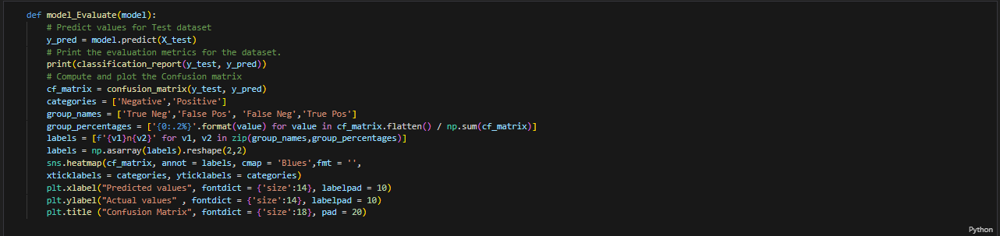

# Project_4: Evaluating reviews of businesses using ML

# Background
The scope of our project is to use a machine learning model to assess the language used by humans when reviewing businesses. These reviews are ran through a trained model and the goal was to see whether or not the model could accurately assess the review as either a positive or negative review, based on the language used by the reviewer.

# Software/Toools:

* Python
* Bokeh
* Pandas
* Excel
* Google/Yelp API
* Numpy
* Nltk
* Pickle
* SKlearn

# Intructions
The assisngment is broken down into the following:

1. Obtain Data to train model
    *Initial trail emotion dataset
    * https://www.kaggle.com/datasets/nelgiriyewithana/emotions 
    * Twitter emotion dataset
    * https://www.kaggle.com/code/mayank404/twitter-sentimental-analysis
    * Yelp Review Dataset
    * 

2. Initializes, trains and evaluates model
    * Training of MultiModelVector and LRTrained2 model
    * Cleaning of the training Dataset
    * 
    * Setting up vectorizer 
    * 
    * Function used to asses the accuracy of model and show confusion matrix 
    * 

3. Extract Data, Clean and Normalize
    * Using google and yelp API to extract the Data used to evauluate the model
    * 
    * Limitations faced while pulling data from API's

4. Model Accuracy / Optimization
    * Below is the accuracy of the model used on the large Dataset it was trained on
    * 
    * Below is an instance of the model being used to evaluate reviews at the local Chili's here in Nashville on West End
    * 
    * 
    Findings: When using a real life example to evaluate the model, it predicited the correct sentiment of the review (positive or negative) with a 90% accuracy when looking at the Chili's on West End
    * Tailoring what stopwords where included to better increase accuracy of model (n't words)

# Ethics
Within this assignment, the only ethical dilemmas that were faced were pertaing to using the API's from google and yelp to obtain reviews. We were intially hoping for a rather large set of data to evaluate the model all at once, however both yelp and google limit the number of reviews one can access. We thought of trying to obtain more reviews through web scraping, however both websites outlaw against scraping reviews for any use. 
